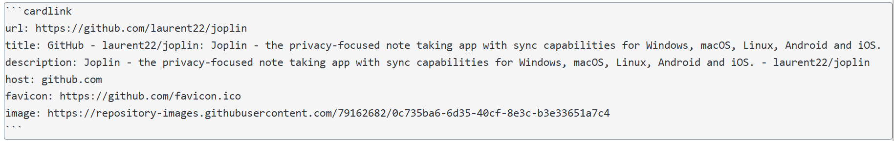

# Joplin Auto Card Link Plugin

This is my first Joplin plugin. I have created it with the intention of learning how to create plugins for Joplin, and I hope it can be useful for others as well.
The development has been done using the [Joplin Plugin Generator](https://github.com/laurent22/joplin/tree/dev/packages/generator-joplin) and the help of [Cline](https://cline.bot/).

The plugin does the same as the "[Auto Card Link plugin](https://github.com/nekoshita/obsidian-auto-card-link)"  for Obsidian, which I have been using for a while and found it very useful.

Usage:

By Pressing `Ctrl + Shift + L` (or `Cmd + Shift + L` on Mac) while the cursor is on a note, the plugin will 
automatically fetch the metadata from a url which is in the clipboard and create a card link in the note. The card link will include the title, description, and image of the webpage.

Here is a screenshot of the plugin in action:

The source looks like this:

 
And the result looks like this:

This Plugin is still in development, and I am open to any suggestions or feedback. If you have any ideas on how to improve the plugin, please feel free to share them with me.